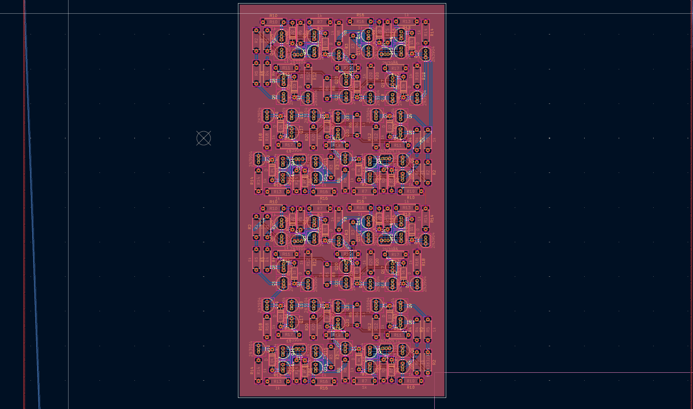
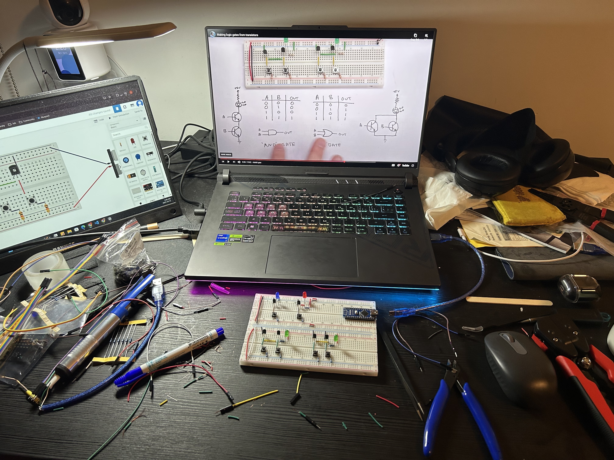

# CPU from Complete Scratch
I have always been dreaming of building a CPU from scratch, which means only transistors, resistors, and capacitors are allowed!!!
The main goal of this is to build my first ever [1-bit adder](https://www.youtube.com/watch?v=RsBQoqHN4rk) that features SUM and Carry

## Components
- 2N3904 transistors
- Resistors (1K, 4.7K, 10K)
- Diodes

## Design

## Logic Gates

## Conclusion
When I first told my friends about this project, they laughed at me cuz they didn't believe how building this was even possible.
This is a very huge milestone as I finally understood how computers work! I learned many things including the basics like logic gates, transistors, and fan-out (this was obnoxious)
XOR caused TONS OF TROUBLES and almost killed my interest lol (btw there were two types and the one failed was the one driving two bases)

