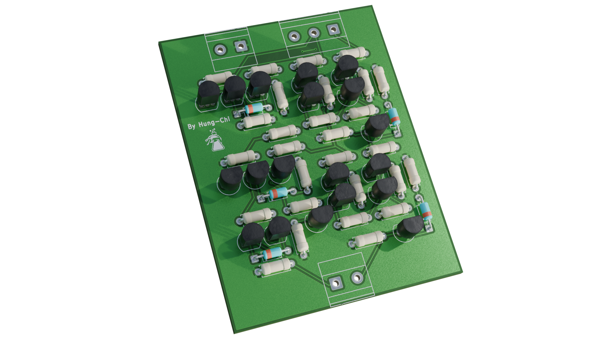
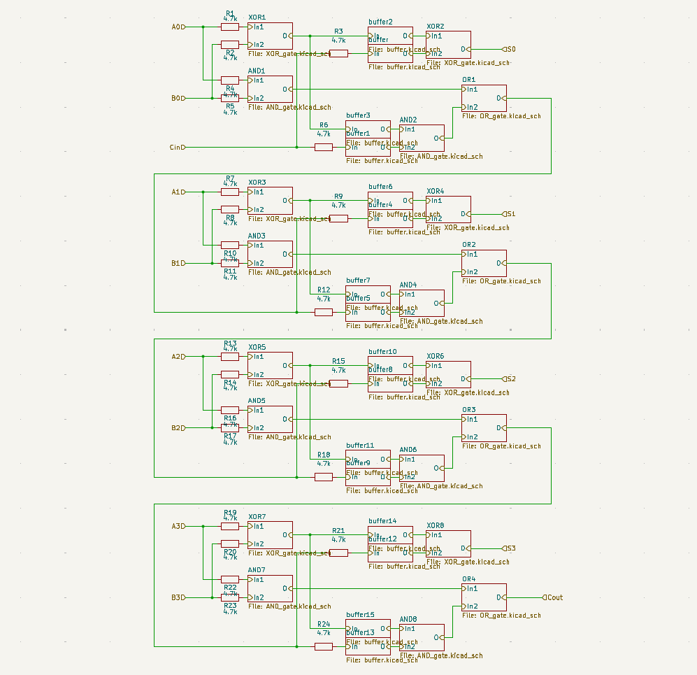
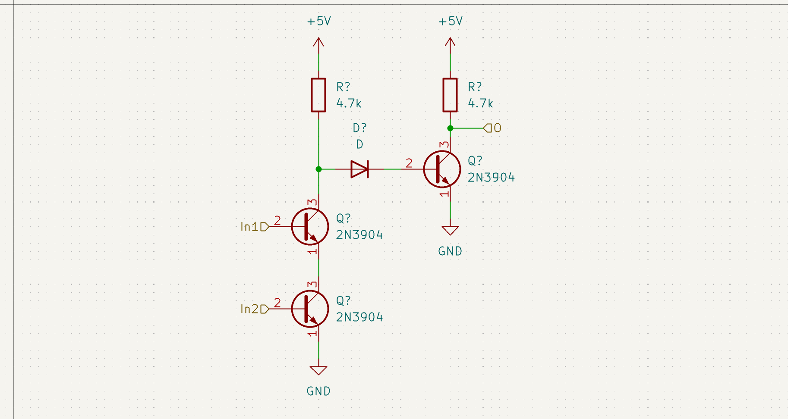
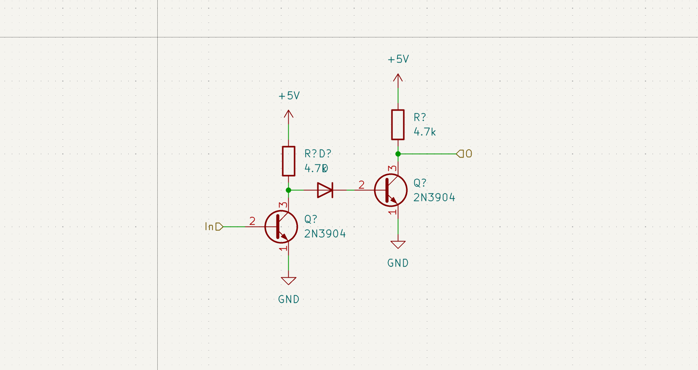
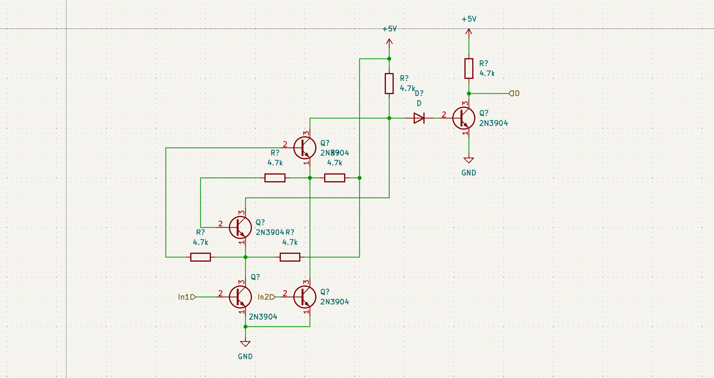
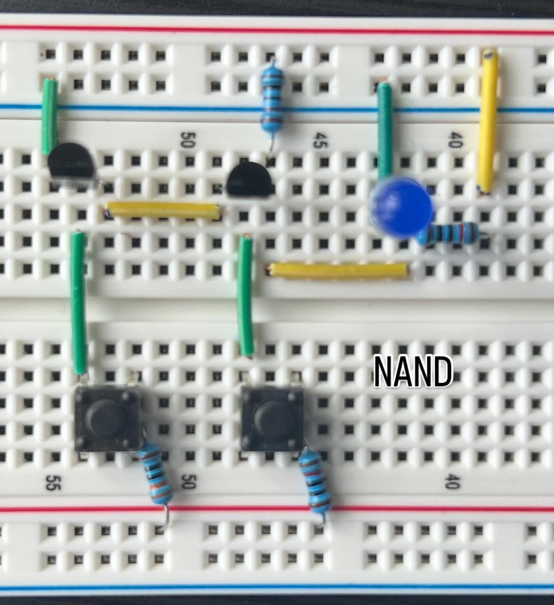
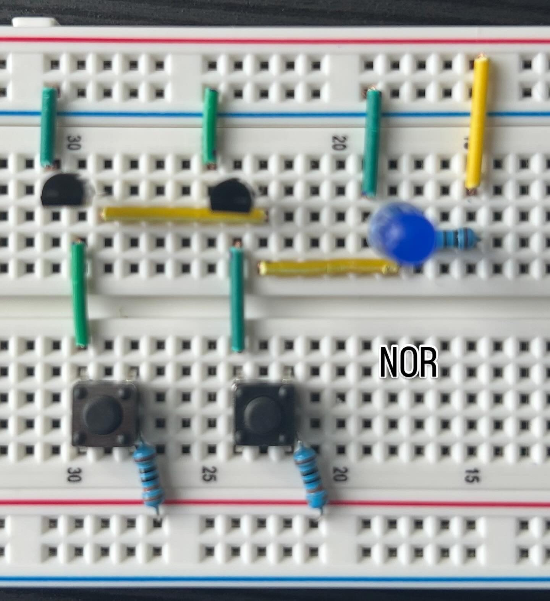
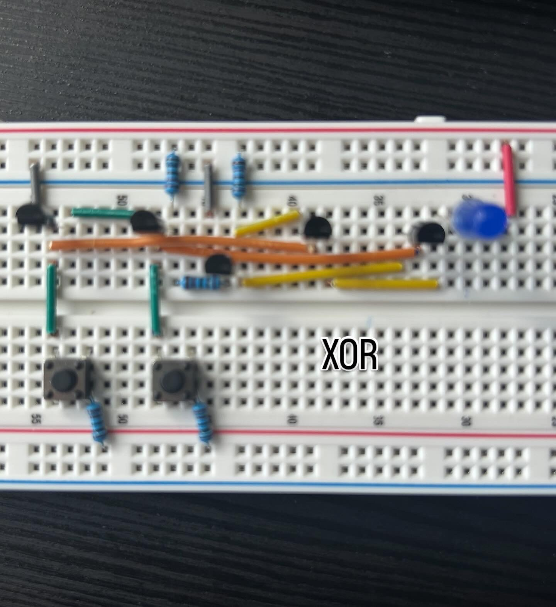

# CPU from Complete Scratch
I have always been dreaming of building a CPU from scratch, which means only transistors, resistors, and capacitors are allowed!!!
The main goal of this is to build my first ever 1-bit adder that features SUM and Carry

# Components
- 2N3904 transistors
- Resistors (1K, 4.7K, 10K)
- Diodes

# Design

# Logic Gates

